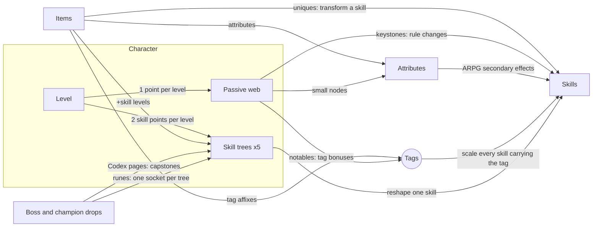

# ARPG character design: skills, passives, attributes and items

Design, not built; Jeff's decisions are recorded where they apply. This replaces the first skill tree (`ARPG-SKILL-TREES.md`, a vanilla talent
grid with ARPG nodes mixed in), after Jeff's review of it in game: it didn't look or play like an
ARPG tree. This doc rethinks how the character systems fit together, then plans the paladin in
full.

Read `ARPG-UNIQUES.md` first: its mechanic kit (chain, arc, burst, pierce…) is one of the
building blocks here.

## What was wrong with the first tree

- **It was a talent grid.** Three columns, tiers, no paths. ARPG trees are about routes: you see
  where you want to end up and plan a path there, and the nodes on the way are part of the choice.
- **Most nodes were vanilla talents.** "+1% crit per rank" five times is the least ARPG thing
  there is.
- **It didn't talk to anything.** Items gave stats, the tree gave stats, skills did what they
  always did. In an ARPG the fun is in the overlaps: an item that makes a tree node better, a
  stat that makes a skill change shape, a skill node that only shines with a certain item.
- **Skills had no depth.** A Judgement build and a Consecration build were the same character
  with different talents ticked.

## The four pillars

1. **Build around skills.** A character is defined by the five skills it specialises in, and
   each of those skills has its own tree that changes how it plays. This is the Last Epoch model,
   and it fits vanilla well: vanilla classes already have the spells, they just lack depth.
2. **One shared language: tags.** Every skill, node and item affix speaks in the same tags
   (Holy, Area, Seal, Melee…). "+20% Area damage" on a ring means something to Consecration and
   Holy Wrath and nothing to Judgement, so items and nodes pick the skills they help without a
   special case each.
3. **Attributes mean something in ARPG terms.** Strength, Agility, Stamina, Intellect and Spirit
   keep what vanilla gives them and gain one ARPG effect each (bigger areas, faster movement,
   shorter cooldowns…). Gearing for Spirit then becomes a build decision, not a healer stat.
4. **Items feed the trees.** Affixes can add levels to a skill (more points in its tree), boost a
   tag, or raise an attribute that a skill node scales with. Uniques transform skills outright.

## How the systems connect

Five layers, one direction of flow: **everything ends up changing what a skill does.** That's
the test for any new node or affix: which skills does it change, and how would a player notice?

## Tags

Every class spell gets tags in server data. Nodes and affixes reference tags, never spells,
unless they belong to one skill's own tree.

| Group | Tags |
|---|---|
| Damage type | Physical, Holy, Fire, Frost, Arcane, Nature, Shadow |
| Delivery | Melee, Spell, Projectile, Area, Ground (lingering zones), Channel, Duration (DoTs, buffs) |
| Role | Heal, Control (stuns, roots, sheep), Movement, Minion, Aura, Seal, Curse, Shout, Totem |

Paladin examples:

| Skill | Tags |
|---|---|
| Strike (the held swing) | Melee, Physical |
| Seals | Seal, Holy, Melee |
| Judgement | Spell, Holy |
| Consecration | Spell, Holy, Area, Ground, Duration |
| Hammer of Justice | Spell, Control, Projectile (once its tree makes it one) |
| Holy Light / Flash of Light | Spell, Holy, Heal |
| Auras | Aura, Holy |

A tag bonus is a damage or healing multiplier the server applies when a spell carrying the tag
lands: one hook in the spell damage and healing bonus path, summing the player's bonuses for
the spell's tags.

## Attributes

The five vanilla attributes keep their vanilla effects, so every vanilla item still works as
designed. Each gains one ARPG effect, at rates that make a dedicated gearer notice without
making the stat mandatory:

| Attribute | Vanilla (unchanged) | ARPG effect | Rate (proposed) | Cap |
|---|---|---|---|---|
| **Strength** | Attack power, block | Melee area: bigger arcs, cleaves and shockwaves | +1% size per 10 Str | +40% |
| **Agility** | Crit, armour, dodge, ranged AP | Movement speed | +1% per 20 Agi | +20% |
| **Stamina** | Health | Life on kill | Stamina ÷ 4 per kill | none |
| **Intellect** | Mana, spell crit | Spell area: bigger Consecration, Holy Wrath, Blizzard | +1% radius per 10 Int | +40% |
| **Spirit** | Regeneration | Cooldown recovery | +1% per 10 Spirit | +30% |

Other ARPG stats exist only on items and tree nodes, never as base attributes: area size,
cooldown recovery, movement speed, life on kill, mana on hit, damage per tag, extra projectiles,
extra chain jumps, and skill levels.

**Why these five:** each is something ARPG builds chase, each maps to a vanilla stat's flavour
(Strength is big swings, Intellect is big spells, Spirit is staying in the fight), and none
replaces a vanilla effect. The rates are a starting point, to tune in play.

## Skills and skill trees

### Specialisation

Jeff's calls: slots unlock by level and show on the bar; points come from character levels;
drops gate the biggest upgrades; and spells have no ranks.

- **Five slots, unlocked by level:** the first at level 1, then 10, 20, 30 and 40. Vanilla hands
  out spells slowly, so this follows its pace, and each new slot is a levelling milestone.
- **The bar is the build:** a specialised skill sits on the ARPG bar (left-click, right-click,
  keys 1 to 4), so what's on the bar is what the character is. Buffs, Blessings and utility spells
  stay castable from the spellbook, without a tree.
- **Skill points: two per level from level 2 to 51,** 100 in all, which fills five trees of 20 by
  level 51. Levels past 51 still give passive web points. Points go into whichever specialised
  skill you like, so a character can rush one skill early.
- **Items raise a skill past 20:** "+2 to Judgement" raises that skill's cap to 22 and gives the 2
  points, spendable only in Judgement.
- **Respec is free:** points move freely within and between trees, and unslotting a skill refunds
  its points.
- **Drops gate the biggest upgrades:** capstones need a Codex page, and each tree has a rune
  socket. See "Drops that unlock skills" below.

### Support and defence skills feed the attacks

Nothing forces a defensive or support pick, but every defence and support tree has a branch that
makes the attack skills hit harder, so five attack skills is the weaker build. Paladin examples:

- **Auras:** Sanctity Aura gives +10% Holy damage; Wide Aura spreads it to the whole pack you're
  fighting.
- **Divine:** when Divine Shield ends, your next three Judgements are critical strikes.
- **Hammer of Justice:** stunned enemies take +15% damage from you (Sentence Passed).
- **Seals:** they are the swing's damage. A Strike build without Seals is half a build.

### What a skill tree looks like

Each tree is a small graph of 12 to 16 nodes, rooted at the skill itself, with three or four
branches and one or two capstones at the ends. The branches compete for the same 20 points.

| Node kind | Look | What it does | Built from |
|---|---|---|---|
| Modifier | Small circle | Numbers: more damage, less cost, bigger radius, longer stun | `SpellModifier` (cmangos spell mods by the skill's family mask) |
| Transformer | Diamond | Changes how the skill works: chains, splits, becomes a projectile, changes damage type | The uniques kit, plus per-skill hooks |
| Synergy | Hexagon | Interacts with another skill or a tag: "Judgement on an enemy in your Consecration..." | Small per-node hooks |
| Capstone | Large star | A big rule change at the end of a branch; needs its Codex page to learn | A hook per capstone |
| Rune socket | Ring | Holds one rune: a portable mechanic for any skill whose tags fit | The uniques kit |

## Drops that unlock skills

Points from levels keep progress steady, so a build never waits on luck for its basics. Drops
gate two things on top: the capstones, and a rune socket per skill.

### Codex pages: the capstones

- **Every capstone is sealed until you read its Codex page,** a book that drops from one named boss
  whose theme fits it (Whirling Strikes from Herod, Walking Consecration from High Inquisitor
  Whitemane). Read once and it's yours for that character; then you still spend points on it.
- **Each page has a home boss and a fallback.** The home boss drops it often enough that a few
  runs find it. Champion packs (from the mob packs step) drop **Codex fragments**, and five
  fragments make any page for a skill you have specialised. Bad luck is never a wall, only a
  slower road.
- **Why capstones:** they're the build-defining part, so finding one is an event ("I finally got
  Blessed Hammer"), and every dungeon has something a build wants from it. Leaving the rest of the
  tree open means a character is never weak for lack of a drop.

### Runes: a socket in every skill tree

- **Each skill tree has one rune socket,** opening once 10 points are in that skill.
- **Runes drop as loot** (blue and better, from bosses and champion packs) and add one portable
  mechanic to the socketed skill, if the skill carries the rune's tag. Socketing is free and
  reversible, so a new rune is an experiment, not a commitment.
- **Runes reuse the uniques kit,** so they're cheap to build and they make every skill a
  candidate for chaining, splitting or echoing, while uniques stay the strongest version of each.
  The same kit on the same skill from a rune, a unique and a tree node doesn't stack: the strongest
  applies.

| Rune | Fits | Effect |
|---|---|---|
| Chains | Spell, single target | The skill chains to 1 more enemy at 50% |
| Splitting | Projectile | +2 projectiles at 40% |
| Echoes | Spell | Every 4th cast repeats at 50% |
| Expanse | Area | +30% area |
| Lingering | Ground, Duration | +50% duration |
| Fury | Melee | Also strikes every enemy in front of you at 30% |
| Haste | Any | −25% cooldown, −15% damage |
| Leech | Any damage | 3% of the damage dealt heals you |
| Command | Control | The control effect spreads to 1 enemy nearby |
| Sanctity | Holy | +15% damage, and the skill counts as Area for Area bonuses |

### Levels past 20

"+N to <skill>" item affixes are the only route past 20, so the third source of skill power is
plain gear. Tomes (a third drop type) aren't needed.

## Spells without ranks

- **A skill is one spell with no "Rank N".** The spellbook shows one Judgement; trainers no
  longer teach spells. A class's skills unlock at the level vanilla first gives them (Consecration
  at 6 for the ARPG paladin), for free.
- **Base power follows your level smoothly.** The server takes vanilla's rank data for your level
  and blends between the two ranks either side of it, so damage and mana cost climb a little every
  level instead of jumping at rank 2, 3, 4.
- **On top of the base:** gear (spell power and attack power, through vanilla's coefficients),
  attributes (their ARPG effects), tags (passive and item bonuses), and the skill's own tree.
- **Downranking goes away** (a cheaper low rank for mana). Mana pacing moves into the trees and
  the web instead: Mana Strike on Seals, Righteous Mind on Judgement, Spirit, Illumination.
- **How it's built:** first, at each level-up the server teaches the vanilla rank for that level
  and removes the lower one, and the client hides "Rank N". The smooth blend between ranks comes
  second, as a damage and cost multiplier.

## The passive web

The class-wide tree. This is the part that should look like an ARPG at a glance: a web of
nodes joined by paths, spreading out from a start node in the middle.

- **About 90 nodes per class** in three regions, one per class fantasy, joined around the start
  and by bridges between regions.
- **Allocation by adjacency:** a node can be taken only if it connects to one you have. The
  start is free.
- **Small nodes** (most of the web, 1 point): +attributes, +% tag damage, +ARPG stats.
- **Notables** (about 18, 1 point, larger and named): one meaningful effect each. Some revive the
  best vanilla talents as single strong nodes ("Vengeance" in one point, not five).
- **Keystones** (5 per class, at the region edges): rules that change how the class plays, with
  a cost attached.
- **Points:** one per level (59 at 60), plus one for the first kill of each dungeon and raid final
  boss (about 20 more). A level 60 takes about 80 of 90, so the last few choices still matter, and
  raid progress grows the build.
- **Respec:** free, out of combat.

## Items

Vanilla items keep their stats. On top of them, the ARPG layer adds:

- **Affixes on generic greens and blues** (`ARPG-ITEMISATION.md` steps 2 and 3), now drawn from
  the same vocabulary as the web:
  - **Attribute:** +Strength, +Spirit…
  - **Tag:** +12% Holy damage, +15% Area damage, +8% Seal damage.
  - **ARPG stat:** +6% movement speed, +8% cooldown recovery, +12 life on kill, +3 mana on hit.
  - **Skill:** +1 to Judgement, +1 to all Holy skills. These are rare and valuable, and they go
    in the item's fourth enchantment slot.
- **Counts by quality:** green 1 affix, blue 2, purple 3. Named dungeon and raid items keep their
  authored stats and get their unique mechanic instead (`ARPG-UNIQUES.md`).
- **Uniques get one more hook:** "+2 to Judgement's Chain node", raising one node past its cap.
  That ties a unique to a build rather than a class.
- **Affix text** reaches the client the way uniques' lines do, as a table sent at the hello, so
  the tooltip shows "+1 to Judgement" in the item's own colour.

## The paladin, in full

### Identity

The ARPG paladin is a holy warrior who **controls ground**: consecrates it, stands in it, and
punishes anything that comes close. Its three fantasies:

- **Crusader:** a hammer-swinging Seal fighter, cleaving packs with every swing.
- **Templar:** an aura-and-shield fortress that hurts everything around it.
- **Lightbringer:** a holy caster whose heals and holy fire are one and the same.

Two vanilla gaps get fixed: **Consecration becomes a baseline spell at level 6** (it's a talent in
1.12), because a paladin without area damage can't play an ARPG; and **Exorcism and Holy Wrath
hit any creature type** for ARPG players (their undead-and-demon limit is a raid mechanic).

### Paladin skills that can be specialised

| Skill | Tags | Vanilla source | Role |
|---|---|---|---|
| Strike | Melee, Physical | The held swing | The left-click |
| Seals | Seal, Holy, Melee | All Seals, as one skill | Swing empowerment |
| Judgement | Spell, Holy | Judgement | Burst, chaining |
| Consecration | Spell, Holy, Area, Ground | Consecration (baseline at 6) | Ground control |
| Hammer of Justice | Spell, Control | Hammer of Justice | Stun, or a thrown hammer |
| Exorcism | Spell, Holy | Exorcism | Single-target nuke |
| Holy Shock | Spell, Holy, Heal | Holy Shock (baseline at 40) | Damage-or-heal |
| Light | Spell, Holy, Heal | Holy Light, Flash of Light | Healing as offence |
| Auras | Aura, Holy | Every aura, as one skill | Passive area |
| Hammer of Wrath | Spell, Holy, Projectile | Hammer of Wrath | Execute |
| Holy Wrath | Spell, Holy, Area | Holy Wrath | Nova |
| Divine | Holy, Movement | Divine Shield, Blessing of Protection | Survival |

Pick five. Each tree below has 20 points to spend by default (more with items). Points cost one
per rank. **[A]** marks a node built from the uniques kit, **[M]** a spell modifier, and **[H]** a
new hook. Every capstone needs its Codex page (table after the trees), and every tree has a rune
socket at 10 points.

#### Strike: the held swing

| Branch | Node | Max | Effect |
|---|---|---|---|
| Root | Strike | – | Your held swing. |
| Reach | Wide Swing **[A]** | 3 | Swings hit every enemy in front of you; the extras take 20/35/50%. |
| Reach | Long Arm **[M]** | 2 | +1/2 yd melee reach. |
| Reach | Whirling Strikes **[H]** | 1 | Every 4th swing hits all around you. *(capstone)* |
| Rhythm | Quickened **[M]** | 4 | +4% attack speed per rank. |
| Rhythm | Momentum **[H]** | 3 | Each consecutive hit on the same pack: +3% damage, stacking 5 times. |
| Rhythm | Crusader's Pace **[H]** | 1 | Kills give 30% movement speed for 3 sec. *(capstone)* |
| Weight | Heavy Hand **[M]** | 4 | +5% physical damage per rank with two-handers. |
| Weight | Stagger **[H]** | 2 | 10/20% chance to daze an enemy for 1 sec. |
| Weight | Shockwave **[A]** | 1 | Crits send a 10 yd shockwave for 40%. *(capstone)* |

#### Seals

| Branch | Node | Max | Effect |
|---|---|---|---|
| Root | Seals | – | Your Seals, as one skill. |
| Righteous | Sweeping Seal **[A]** | 3 | Seal of Righteousness hits every enemy in front of you, at 20/35/50%. |
| Righteous | Holy Edge **[M]** | 4 | +6% Seal damage per rank. |
| Righteous | Twin Seals **[H]** | 1 | Two Seals can be active at once. *(capstone)* |
| Command | Commanding Seal **[H]** | 1 | Seal of Command becomes baseline. |
| Command | Command Arc **[A]** | 2 | Seal of Command procs hit every enemy in front of you at 40/60%. |
| Command | Relentless **[M]** | 3 | +1 Seal of Command proc per minute per rank. |
| Crusader | Zeal **[M]** | 3 | Seal of the Crusader's speed bonus +10% per rank, without its damage loss. |
| Crusader | Mana Strike **[H]** | 3 | Seal hits give 1/2/3% of max mana. |
| Crusader | Light of the Crusader **[H]** | 1 | Seal hits heal you for 5% of the damage. *(capstone)* |

#### Judgement

| Branch | Node | Max | Effect |
|---|---|---|---|
| Root | Judgement | – | Unleash your Seal on an enemy. |
| Chain | Chain of Judgement **[A]** | 3 | Judgement chains to 1/2/3 more enemies within 10 yd, at 50%. |
| Chain | Echoing Verdict **[M]** | 3 | Chain jumps lose 10% less damage per rank. |
| Chain | Final Verdict **[H]** | 1 | A Judgement kill refreshes its cooldown. *(capstone)* |
| Burst | Hammer of Light **[A]** | 3 | Judgement bursts onto enemies within 4/6/8 yd at 40%. |
| Burst | Radiance **[M]** | 4 | +8% Judgement damage per rank. |
| Burst | Sentence **[H]** | 1 | Judgement deals double damage to stunned enemies. *(capstone)* |
| Seal | Avenger **[H]** | 1 | Judgement no longer consumes your Seal; its cooldown is doubled. |
| Seal | Swift Judgement **[M]** | 3 | −1 sec cooldown per rank. |
| Seal | Righteous Mind **[H]** | 2 | Judgement restores 5/10% of max mana. |

#### Consecration

| Branch | Node | Max | Effect |
|---|---|---|---|
| Root | Consecration | – | Consecrate the ground under you. |
| Ground | Wide Blessing **[M]** | 4 | +10% radius per rank (scales with Intellect too). |
| Ground | Lasting Ground **[M]** | 3 | +2 sec duration per rank. |
| Ground | Walking Consecration **[H]** | 1 | Consecration follows you. *(capstone)* |
| Smite | Burning Ground **[M]** | 4 | +8% Consecration damage per rank. |
| Smite | Searing Light **[H]** | 2 | Enemies standing in it take +5/10% Holy damage from you. |
| Smite | Sanctified **[H]** | 1 | Your Judgements on consecrated enemies burst at 50% (stacks with Hammer of Light). *(synergy)* |
| Refuge | Hallowed Ground **[H]** | 3 | You regenerate 1/2/3% health per second inside it. |
| Refuge | Steadfast **[H]** | 1 | Inside it you can't be stunned. |
| Refuge | Sacred Seal **[H]** | 1 | Seals hit twice on consecrated enemies. *(capstone)* |

#### Hammer of Justice

| Branch | Node | Max | Effect |
|---|---|---|---|
| Root | Hammer of Justice | – | Stun an enemy. |
| Thrown | Hurled Hammer **[A]** | 1 | It becomes a skillshot thrown along your aim, 20 yd. |
| Thrown | Ricochet **[A]** | 3 | The hammer chains to 1/2/3 more enemies. |
| Thrown | Blessed Hammer **[H]** | 1 | Three hammers spiral out around you. *(capstone; the Diablo hammerdin)* |
| Control | Shockwave Hammer **[A]** | 2 | Also stuns 1/2 enemies near the target. |
| Control | Long Stun **[M]** | 3 | +0.5 sec stun per rank. |
| Control | Quick Hammer **[M]** | 3 | −10 sec cooldown per rank. |
| Holy | Holy Hammer **[H]** | 3 | The hammer deals Holy damage (weapon-based), more per rank. |
| Holy | Sentence Passed **[H]** | 1 | Stunned enemies take +15% damage from you. *(capstone)* |

#### Auras

| Branch | Node | Max | Effect |
|---|---|---|---|
| Root | Auras | – | Your auras, as one skill. |
| Retribution | Martyr's Ward **[H]** | 3 | Retribution Aura also pulses at every enemy within 10 yd each second, at 50/75/100% of its damage. |
| Retribution | Burning Aura **[M]** | 4 | +15% Retribution Aura damage per rank. |
| Retribution | Sanctity Aura **[H]** | 1 | Learn Sanctity Aura (+10% Holy damage). |
| Devotion | Bulwark **[M]** | 4 | +10% Devotion Aura armour per rank. |
| Devotion | Unbroken **[H]** | 2 | −5/10% damage taken while three or more enemies are near. |
| Concentration | Focused **[M]** | 3 | Concentration Aura also gives +5% cast speed per rank. |
| All | Wide Aura **[M]** | 3 | +10 yd aura range per rank. |
| All | Dual Aura **[H]** | 1 | Two auras at once. *(capstone)* |

#### The other six, in brief

| Skill | Branch ideas | Capstone |
|---|---|---|
| Exorcism | Burning (DoT after the hit), Chain (jumps), Purge (strips a buff) | Exorcism hits every enemy in a 10 yd cone |
| Holy Shock | Chain (Arcing Shock), Return (heals you when it hits), Echo | Holy Shock hits an enemy and heals you at once |
| Light | Overflow (overheal becomes holy damage nearby), Speed (cast time), Beacon | Dawnbringer: heals on yourself send a holy bolt at the nearest enemy |
| Hammer of Wrath | Pierce, Extra hammers (kit A), Below-50% use | Usable at any health; executes below 20% |
| Holy Wrath | Radius, Stun, Cooldown | Holy Wrath fires on its own whenever you're surrounded |
| Divine | Shield (Divine Shield lets you attack, at half damage), Blessing (BoP on yourself grants speed) | Lay on Hands also nukes everything around you |

#### Paladin Codex pages

| Capstone | Skill | Home boss |
|---|---|---|
| Crusader's Pace | Strike | Mr. Smite, Deadmines |
| Whirling Strikes | Strike | Herod, Scarlet Monastery |
| Shockwave | Strike | Ironaya, Uldaman |
| Twin Seals | Seals | Arcanist Doan, Scarlet Monastery |
| Light of the Crusader | Seals | High Inquisitor Fairbanks, Scarlet Monastery |
| Final Verdict | Judgement | Scarlet Commander Mograine, Scarlet Monastery |
| Sentence | Judgement | Emperor Dagran Thaurissan, Blackrock Depths |
| Walking Consecration | Consecration | High Inquisitor Whitemane, Scarlet Monastery |
| Sacred Seal | Consecration | Balnazzar, Stratholme |
| Blessed Hammer | Hammer of Justice | Baron Rivendare, Stratholme |
| Sentence Passed | Hammer of Justice | Overlord Wyrmthalak, Lower Blackrock Spire |
| Dual Aura | Auras | Golemagg, Molten Core |

Scarlet Monastery holds five of them on purpose: it's the paladin's dungeon, and the levels
where it's run (30 to 45) are when builds take shape.

### The paladin passive web

Three regions around a start node, about 90 nodes. Small nodes are listed by their cluster; each
cluster is 3 to 5 small nodes on the path to a notable.

**Crusader region (north-west):** Strength, physical damage, Seals, Strike.

| Kind | Name | Effect |
|---|---|---|
| Cluster | Might | +5 Strength each (×4) |
| Cluster | Edge | +3% Melee damage each (×4) |
| Notable | Two-Handed Mastery | +12% damage with two-handers |
| Notable | Conviction | +4% melee crit |
| Notable | Vengeance | After a crit, +10% physical and Holy damage for 8 sec |
| Notable | Righteous Fervour | +15% Seal damage, Seals cost 30% less |
| **Keystone** | **Zealot** | +25% attack speed; Seals drain 1% mana per second |
| **Keystone** | **Crusade** | Each kill in the last 5 sec gives +4% damage (max 10 stacks); out of combat you're 20% slower |

**Templar region (south):** Stamina, armour, auras, blocking, control.

| Kind | Name | Effect |
|---|---|---|
| Cluster | Fortitude | +6 Stamina each (×4) |
| Cluster | Plate | +4% armour each (×4) |
| Notable | Shield Wall | +10% block, blocks heal 1% health |
| Notable | Redoubt | Being crit gives +30% block for 10 sec |
| Notable | Reckoning | Being crit has a 20% chance to grant an extra swing |
| Notable | Righteous Fury | +20% Holy damage while three or more enemies are near |
| **Keystone** | **Martyr** | Damage you take is shared with every enemy within 10 yd (25% of it, as Holy); your healing taken is halved |
| **Keystone** | **Unyielding** | You can't be stunned or slowed; −20% movement speed |

**Lightbringer region (north-east):** Intellect, Spirit, Holy spells, healing.

| Kind | Name | Effect |
|---|---|---|
| Cluster | Wisdom | +5 Intellect each (×4) |
| Cluster | Devotion | +5 Spirit each (×3) |
| Cluster | Radiant | +4% Holy damage each (×4) |
| Notable | Illumination | Holy crits refund 50% of their mana cost |
| Notable | Holy Power | +5% Holy crit |
| Notable | Healing Light | +15% healing, and heals on yourself +15% more |
| Notable | Divine Favour | Every 20 sec, your next Holy spell crits |
| **Keystone** | **Lightforged** | Your healing is converted into Holy damage to the nearest enemy, and your heals no longer heal you; +30% Holy damage |

**Bridges:** a few nodes link regions, so hybrids pay a toll: Crusader–Lightbringer ("Holy
Weapons": +3% Holy damage per 10 Strength), Templar–Crusader ("Shield and Hammer": one-handers
+10% damage with a shield), Lightbringer–Templar ("Aegis": +5 Stamina, +3 Spirit).

### Example builds at 60

- **Hammerdin (Hammer of Justice, Judgement, Consecration, Seals, Auras).** Hammer of Justice
  thrown with Blessed Hammer, Consecration walking with you, Judgement chaining. Web leans
  Lightbringer for Intellect (radius) and Spirit (cooldowns). Wants +Hammer of Justice affixes
  and Spirit gear: a caster-paladin in plate.
- **Crusader (Strike, Seals, Judgement, Consecration, Divine).** Wide Swing and Sweeping Seal
  cleave every pack, Twin Seals, Avenger keeping the Seal up. Web takes Crusader with Zealot.
  Wants Strength (bigger arcs) and attack speed: Smite's Mighty Hammer early, Spinal Reaper late.
- **Templar (Auras, Consecration, Hammer of Justice, Holy Shock, Light).** Martyr's Ward and
  Martyr keystone: stand in Consecration in the middle of a pack while auras burn it down. Wants
  Stamina (life on kill) and armour.
- **Lightbringer (Light, Holy Shock, Exorcism, Holy Wrath, Consecration).** Lightforged turns
  every heal into a bolt; Overflow chains overheal. Wants Intellect and Spirit, and +Light.

## How it gets built

### Server effect primitives

Every node and affix effect is one of a small set, so a new node is a data row, not code, except
for capstones and hooks:

| Primitive | What it does | cmangos route |
|---|---|---|
| Stat | +attribute, armour, resistance | `HandleStatModifier` |
| Spell modifier | Damage, cost, cooldown, radius, range, duration, crit, cast time, jump targets on one skill | A `SpellModifier` added to the player for the skill's family mask (`SPELLMOD_*`) |
| Tag bonus | % damage or healing for spells with a tag | One hook in the spell damage and healing bonus path |
| ARPG stat | Movement speed, cooldown recovery, life on kill, mana on hit, area size | Small hooks: speed update, cooldown add, kill, hit, radius |
| Kit | Chain, arc, burst, pierce, spread, echo, raise, step | The uniques' kit (built) |
| Hook | Capstones, synergies, keystones | One function each |

### Data and storage

- **Tables in code**, as the uniques and the current tree are: tags per spell, the web (nodes,
  their position and links), each skill tree, each affix family.
- **Saved:** `character_arpg_tree` grows a column for which tree a node belongs to (the web, or a
  skill); `character_arpg_skill` holds each skill's slot and socketed rune; `character_arpg_codex`
  the pages read.
- **New items:** Codex pages, fragments and runes are new `item_template` rows, shipped as a fork
  SQL file that the server update script applies.

### Client

- **The tree is drawn by the client in Rust, not in Lua:** a pan-and-zoom canvas with nodes as
  circles, diamonds and stars, and paths as lines between them, glowing where allocated. The
  1.12 Lua UI can't draw lines; the client's own overlay can.
- **One window, tabs:** the passive web, then a tab per specialised skill.
- **The server sends positions and links** with the tree, so the layout is server data and a
  new node needs no client release.

### Phases

1. **Tags, attributes and the web.** Tag bonuses, the five attributes' ARPG effects, the paladin
   web with its small nodes, notables and keystones, and the canvas window. This replaces the
   current tree.
2. **Skill specialisation and spells without ranks.** Slots by level, the skill point pool, rank
   handling, and the paladin's five most-wanted skill trees (Strike, Seals, Judgement,
   Consecration, Hammer of Justice).
3. **Codex pages and runes** (needs the mob packs step for champion packs and fragments).
4. **The other seven paladin skill trees** and the ARPG item affixes, including +skill levels.
5. **Other classes**, one at a time, starting with whichever Jeff plays next.

## Open questions for Jeff

- **The attribute rates and caps** in "Attributes": a fair first pass?
- **Codex page homes:** the bosses above are chosen for theme. Swap any that feel wrong.
